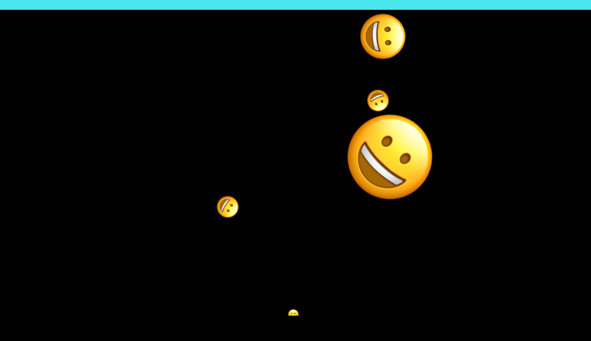

# Whack-Emoji 

Originally made for a code challenge at work.

Click on the correct emoji to score points!


# install

download the repository

run ```npm install``` in the directory to download the dependencies.

run ```npm run dev``` to start up the game locally in the browser and make code changes.

